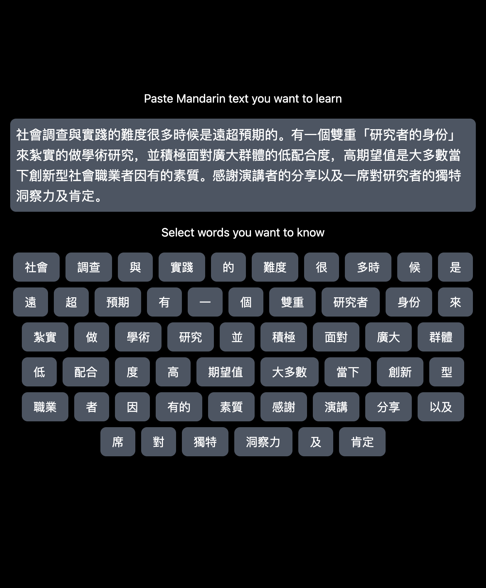
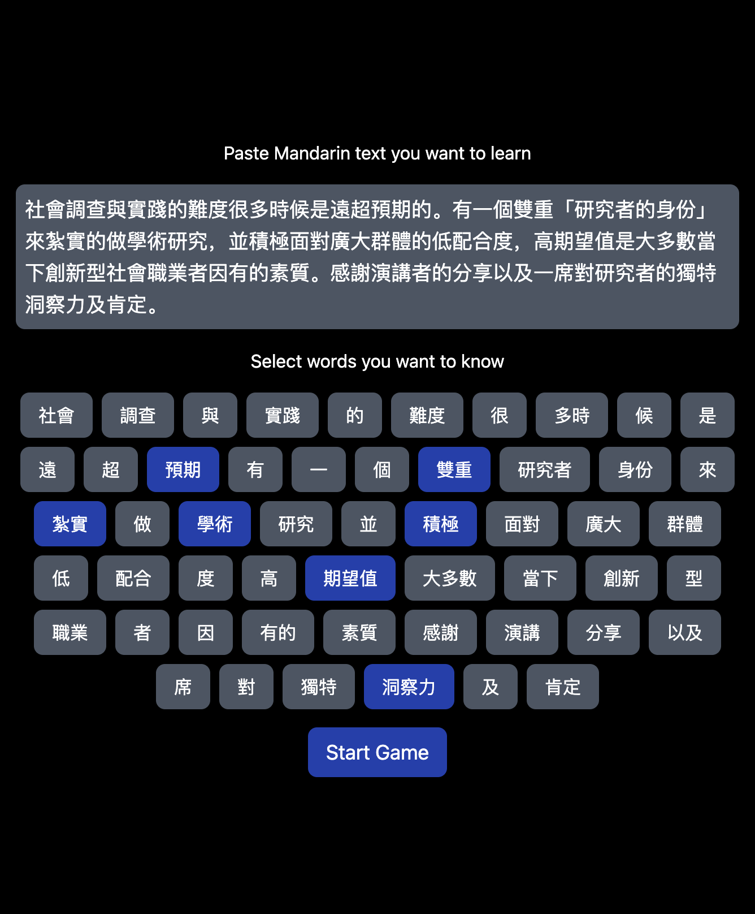
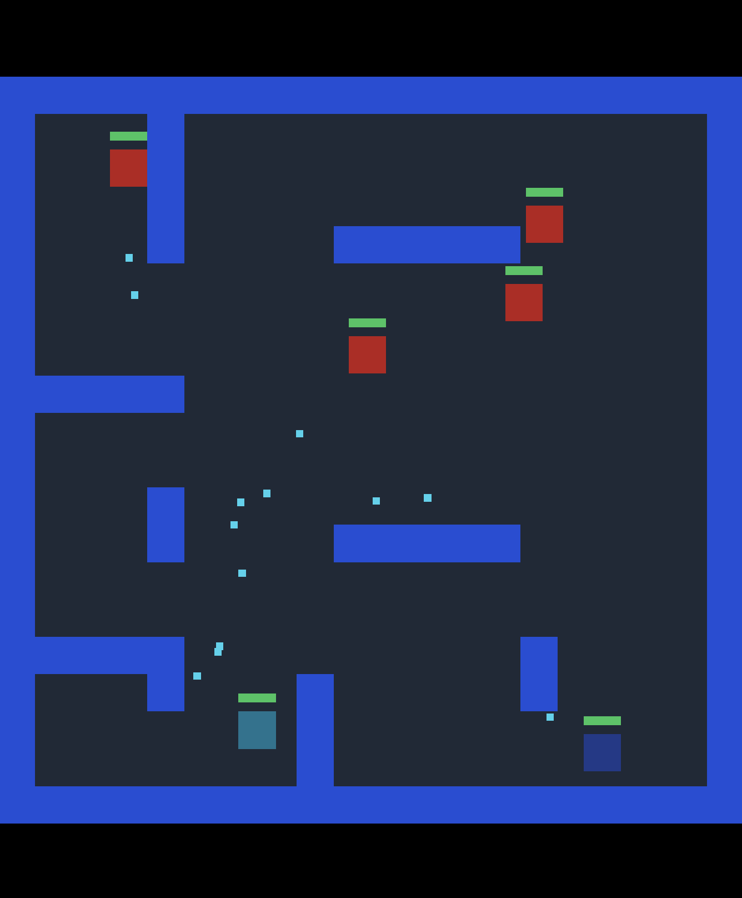
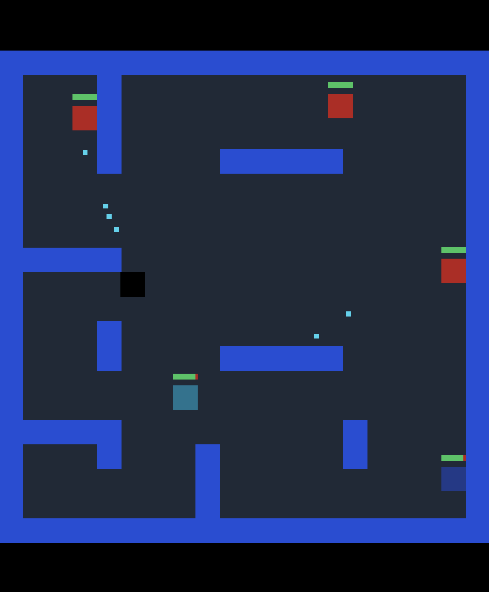
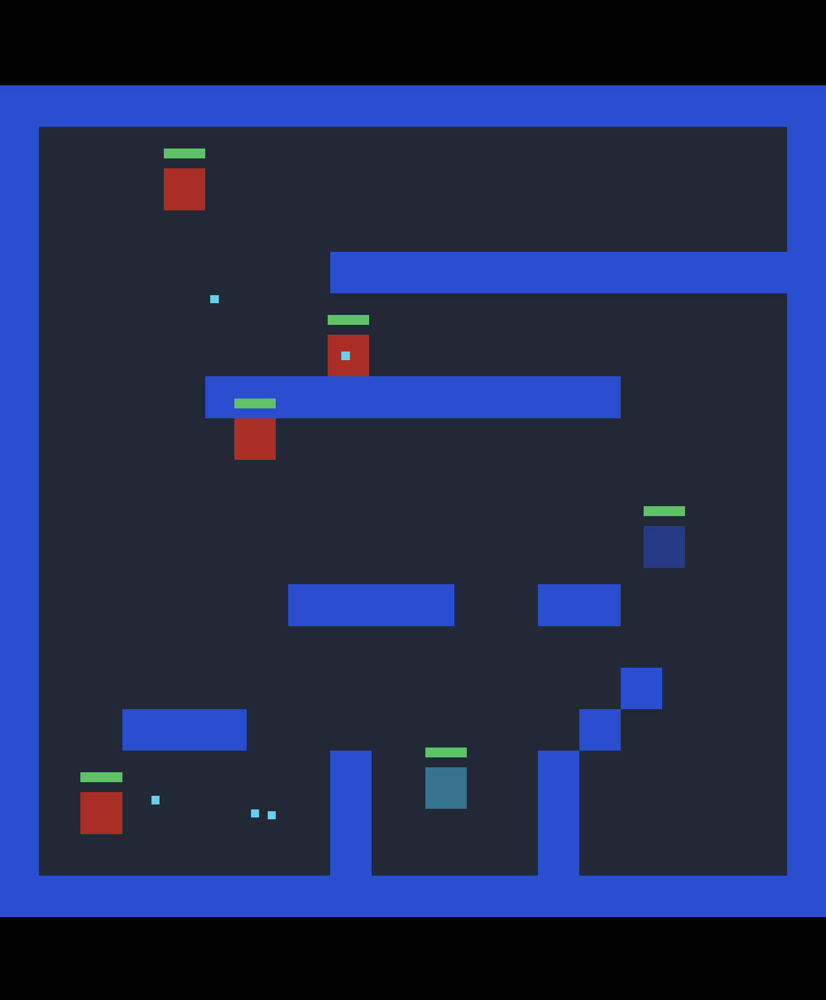

# Mandarin Maze Game

Enter in Mandarin words you want to learn then play a maze game to learn them.

## How to play the game

Paste in Mandarin text you want to learn.

Select the words you want to know. Then click the start game button.

Move around using the arrow keys and shoot by holding down the "w" key.

When an enemy's health drops to 0, it will drop a word.

When you pick up the word, it teaches you the meaning of that word.

Once you defeat all the enemies and collect all the words, you can go to the next level.

Before you can go to the next level, you must review all the words you picked up.

Once you learn all the words, you go to the next level where there are more enemies to defeat and more words to learn!

